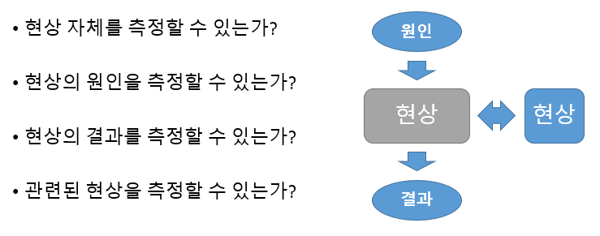
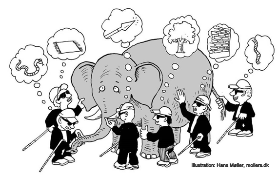

# 측정의 실제

이 장에서는 효과적인 측정을 위한 단계를 구체적으로 소개하려고 합니다. 이를 통해 측정을 통해 주어진  문제를 해결할 수 있는 사고의 틀을 확립하는 것이 목표입니다. 다음 장에서는 사례를 통해 이를 적용하는 방법을 다루게 됩니다.

## 측정 계획하기 ##

여기서는 실제 측정에 앞서 이를 계획하는 과정을 생각해 봅시다. 문제 해결을 위한 측정의 과정은 크게 문제 정의와 측정 계획 수립으로 나누어 생각해 볼 수 있습니다. 

### 문제 정의하기

제대로 된 교육은 문제 푸는 법을 가르치는 것이 아니라 풀만한 가치가 있는 문제를 찾는 것이라는 말이 있듯이, 문제를 올바로 정의하는 것은 제대로 된 측정의 시작입니다. 여기서 올바른 문제 정의는 도전할만한 가치가 있지만 실현 가능성이 충분하며, 최대한 구체화어, 궁극적으로는 해결책의 탐색을 손쉽게 해주는 것을 말합니다.

측정을 위한 문제 해결법이 매력적인 이유는 이러한 올바르고 구체적인 문제정의를 기본으로 하기 때문입니다. '측정할 수 없는 현상은 개선할 수도 없다'는 말이 있듯이, 눈에 보이지 않는 목표를 눈에 보이는 현상으로 대체하는 과정에서 목표의 타당성을 검증하고 목표 달성을 위한 실마리를 찾는 기회를 얻게 됩니다. 

우선 달성하고 싶은 목표를 생각해 봅시다. 어떤 목표의 경우에는 문제가 너무나 명확합니다. 예컨데, 어떤 직장에 들어가고 싶다거나, 시험에 합격하고 싶다는 등의 목표가 여기에 해당합니다. 하지만 많은 목표는 추상적인 개념의 형태를 띱니다.  '올해는 더 행복해지고 싶다', '우리 가족이 더 화목해졌으면 좋겠다' 등의 목표가 여기에 해당됩니다.

#### 구체적인 목표의 필요성

이런 추상적인 목표를 생각해 보는 것은 좋은 출발점이지만, 목표 달성을 위해서는 좀더 구체화시킬 필요가 있습니다. 추상적인 목표는 달성 여부와 정도를 제대로 알수가 어렵고, 따라서 동기 부여에도 어려움이 따르기 때문입니다. Doug Hubbard는 저서 [How to Measure Anything][HTMA]에서 다음과 같은 구체화의 3단계(Clarification Chain)을 통해 추상적인 대상을 구체적인 측정의 대상으로 바꿀 수 있다고 말합니다. 

1. 만약 중요한 일이라면, 어떤 식으로든 관찰 가능할 것이다.
2. 관찰 가능한 일은 수치 혹은 범위로 표현될 수 있다.
3. 수치 혹은 범위로 표현될 수 있는 일은 측정이 가능하다. 

이를 요약하면, 자신에게 중요한 일이라면 어떤 식으로든 관찰/감지될 수 있을 것이고, 그렇다면 이는 어떤 수량이나 범위로 측정될 수 있기에, 모든 것은 측정의 대상이라는 것입니다. 반대로 어떤 형태로도 관찰이 불가능한 일은 자신에게 중요한 일이 아니라는 논리도 성립합니다. 

#### 어떤 대상도 측정할 수 있는 방법

이를 좀더 구체적으로 생각해 봅시다. 눈에 보이지 않는 어떤 현상을 측정하려고 한다고 가정합시다. 이런 경우에도 그 현상의 직접적인 원인이나 결과는 측정이 가능한 경우가 있을 것입니다. 혹은, 마치 물체가 움직일 때 그림자가 같이 움직이는 것처럼 목표가 되는 현상과 밀접하게 관련된 현상이 있을 수도 있습니다.

<!-- 사례? -->

이렇게 목표를 구체적인 현상으로 치환하다보면 현상이 원래 생각했던 목표의 일부만을 포함하는 경우를 자주 발견하게 됩니다. 추상적인 개념을 하나의 현상으로 대체하는 것은 쉽지 않은 것은 당연한 일입니다. 많은 경우 추상적인 목표를 구체화하는 과정에서 원래 목표를 100% 포착하기는 힘들기 때문에 이는 어찌보면 '장님 코끼리 만지기'와 비슷할지도 모릅니다. 

하지만, 추상적인 문제를 그대로 둔채 해결하려는 것보다 그 단편이라도 지표화시킬 수 있다면 그 해결에 한단계 다가갈 수 있다는 것이 제 생각입니다. 영어로 거북하지만 감히 손대기 힘든 문제를 방안의 코끼리(Elephant in the Room)라고 하는데, 이런 코끼리를 애써 무시하기보다는 조금씩 더듬어서라도 알아내려고 하는 자세가 측정에 의한 문제해결의 기본입니다.

나아가 충분히 많은 수가 있다면 맹인이라도 코끼리를 정확히 그려낼 수 있을 것입니다. 이처럼 현실적인 문제 해결을 위해서는 서로 보완적인 지표 여러개를 동시에 사용하는 방법도 있습니다. 기업에서 성과 측정을 위해 여러 지표를 동시에 사용하는 것도 이러한 이유에서입니다.

<!-- 
검색 품질 사례?

다음 장에서 자세히 설명하겠지만, 대부분의 복잡한 대상은 그 구성요소로 나누어서 좀더 효과적인 측정이 가능합니다. -->

또한, 측정의 대상에는 직접적인 목표만이 포함되는 것은 아닙니다. 자신이 달성하고자 하는 목표와 관련된 값도 같이 측정해야 합니다. 목표에 얼마가 가까히 같느냐 만큼이나, 어떤 요인이 영향을 끼쳤느냐도 중요한 변수이기 때문입니다. 따라서 측정 방법을 고안할 때는 대상 변수 만큼이나 주변 요인도 같이 얻을 수 있어야 합니다. 

요약하면 문제 정의 단계에서는 다음 질문에 대한 답을 구해야 합니다. 

* 내가 달성하고 싶은 목표는 무엇인가?
* 목표의 달성 여부를 어떻게 알 수 있는가?
* 이를 위한 진행상황을 어떻게 측정할 수 있는가?
* 이와 관련된 변수에는 어떤 것들이 있는가?

### 측정 계획 세우기

자신의 목표에 적절한 측정 방법을 고안한 후에는 구체적인 측정 계획을 세워야 합니다.  측정 계획을 세우는 것은 측정 목표를 주어진 시간과 비용의 제약 내에서 이루어내기 위해 꼭 필요한 일입니다. 측정 계획을 세우기 위해서는 우선 다음 사항을 정확히 알아야 합니다.

* 측정 대상이 되는 변수들
* 요구되는 측정의 품질 (정확도)
* 측정에 사용할 수 있는 비용
* 목표 달성을 위해 주어진 시간

우선 측정 대상이 되는 변수들은 앞 단계에서 이미 결정되어 있다고 가정합시다. 하지만 측정에 필요한 비용과 시간을 정확히 알기 위해서는 요구되는 측정의 품질을 알아야 합니다. 요구되는 품질이 높아질수록 소요되는 비용과 시간이 늘어나기 때문입니다. 

우선 비용 측면에서 체중계를 비롯한 대부분의 측정 기구는 측정치의 정확도가 높아질수록 더 정교한 메커니즘을 요구하기에 가격이 높아집니다. 측정치의 정확도를 높이는 다른 방법으로는 반복 측정 후 이를 평균할 수 있는데, 이 역시 (측정의 종류에 따라 다르지만) 더 많은 시간 및 비용이 소모되는 방법입니다. 

따라서 자신이 어떤 수준의 품질을 원하는지 잘 생각해보고, 이를 위해서 가용한 자원을 종합적으로 고려해 측정 계획을 세워야 합니다. 단, 앞서 밝혔듯이 측정은 조금씩 개선하면서 반복되는(iterative) 프로세스인 만큼, 이를 고려하여 시간과 예산을 배분해야 합니다.

특히 새로운 측정 방법을 개발해서 사용하는 경우, 원하는 품질을 달성하기 위한 비용과 시간을 제대로 산정하기 어려울 것입니다. 이런 경우에는 실제 측정에 들어가기에 앞서, 일단 데이터를 어느 정도 모아 그 특성과 분포를 관찰하는 파일럿 스터디를 수행한 후에, 본 측정에 들어가는 식으로 계획을 세우는 것이 필요합니다. 

<!-- 
여기서 중요한 고려사항은 자신이 달성하고자 하는 목표의 종류와 특성입니다.
계획 수립에 대한 가이드라인? 
--> 

<!--
요약하면 측정 계획 수립 단계에서는 다음 사항에 대한 답을 얻을 수 있어야 합니다.

* 측정의 주된 대상이 되는 현상은 무엇인가? 
* 이와 관련된 현상은 무엇인가?
* 측정에 수반되는 비용과 예산은?
-->

## 측정 수행하기 ##

전 단계에서 측정에 대한 밑그림을 그렸다면, 이제 실제로 측정을 수행하는 단계에 대해 알아봅시다.

### 측정 준비하기

측정에 필요한 데이터를 수집하기 위해서는 적절한 장치가 필요합니다. 앞서 측정의 종류를 그 방법에 따라 크게 자동과 수동으로 나누었는데, 자동 측정에는 대부분 기계적/전자적인 장치가 사용되겠지만, 수동적 측정은 주어진 장치를 사람이 조작해서 측정값을 얻는 경우와 (e.g., 체중계) 아예 사람에게서 설문 등을 통해 측정값을 얻는 경우로 나눌 수 있습니다. 

저동과 수동 측정의 장단점을 좀더 생각해봅시다. 측정 편의성 면에서는 당연히 자동이 선호되겠지만, 자동 측정은 그 정의상 측정 대상이 인지하지 못하는 사이에 측정이 이루어진다는 특성이 있습니다. 이는 대부분의 경우 누락이나 오류 없이 일관되게 측정할 수 있고, 관찰 효과(Observer Effect)에 의한 편향을 최소화하는 장점으로 생각될 수 있지만, 자기 측정과 같이 스스로 측정 행위에 대한 자각(awareness)를 가져야 하는 경우에는 오히려 사람의 수동적인 개입이 그런 자각을 유지하는데 도움이 될 수도 있습니다.

일단 측정 수단이 결정된 뒤에는 데이터를 지속적으로 모니터링할 수 있는 방법을 생각할 차례입니다. 특히 수동 측정의 경우에는 측정한 데이터를 기록할 수 있는 별도의 수단이 필요합니다. 분석 단계에서의 데이터 처리를 위해서는 컴퓨터와 같은 정보기기를 사용해 기록하는 것을 추천할만하지만, 운동이나 이동 중과 같이 컴퓨터 사용이 용이하지 않은 경우, 종이나 스마트폰을 사용할 수도 있습니다.

<!--
 * 측정 장비 / 장치
	 * 자동 vs 수동
	 * 기계적 vs 인간
	 * 소프트웨어: 처리 용이
 * 측정 노트 (DB)
	 * 종이 / 펜
	 * 소프트웨어
 * 좋은 측정수단의 조건
	 * 편향 & 분산이 적어야
	 * 주된 활동을 방해하지 않아야
	 * 비용이 적어야
-->

### 데이터 수집하기

측정을 위한 준비가 완료되었다면 데이터를 모으고 지속적으로 그 상황을 모니터링할 수 있는 수단이 갖추어졌을 것입니다. 이제 실제로 데이터를 모아야 할 차례입니다. 

데이터 수집 단계에서 가장 중요한 덕목은 일관성입니다. 데이터를 모으는 과정에서 측정 방법이 바뀐다면 결과의 품질을 보장할 수 없기 때문입니다. 따라서 중간에 더 좋은 측정 방법이 생각났다고 하더라도 처음에 측정을 결심한 기간 동안은 동일한 방법을 유지해야 합니다. 개선된 측정 방법을 적용하는 것은 데이터 분석이 끝나고 다시 측정을 시작할 때 생각해볼 문제입니다. 이런 이유에서도 명확한 측정 목표를 갖는 것은 중요합니면 일관성을 유지하기 어렵기 때문입니다.

하지만 이는 무조건 초기의 계획을 고수해야 한다는 말은 아닙니다. 계획한 기간이 끝나기 전이라도 측정 목표가 달성되었다면 그 시점에서 측정을 그만둘 수 있는 유연성도 필요합니다. 이러한 측정의 조기 중단은 시간과 비용을 줄이는 효과적인 방법인데, 이런 종류의 의사결정을 내리는 방법에 대해서는 다음 장에서 자세히 설명합니다. 물론 같은 원리로 측정 목표가 달성되지 못한 경우에는 예상 기간이나 비용을 초과해서라도 그 목표를 달성해야 하는 경우도 있습니다.
<!--
* 일관성
* 유연함
* 꾸준함
-->

#### 단계1: 현황 측정하기

<!--

-->

#### 단계2: 변화 측정하기

### 데이터 처리 및 분석하기

어느 정도 데이터가 모인 뒤에는 데이터를 처리하여 지표(statistics)를 계산해 볼 수 있습니다. 여기서 지표는 측정값을 요약하는 수치입니다. 지표는 간단하 측정값을 평균하는 식으로 계산될 수도 있지만, 측정 대상의 특성에 맞는 지표를 디자인하는 것은 해당 분야에 대한 고도의 지식을 요구하는 작업입니다. 예컨데 검색 결과의 품질을 요약하는 지표에 대한 논문만 수백 건이 있습니다.

<!--
* 지표 디자인
	* 데이터 선처리
* 분석의 종류
	* 두 표본을 비교하기
	* 특정 값을 기준으로 비교하기
	* 
-->

## 측정법 개선하기 ##

### 측정법 평가하기

### 측정법 개선하기

[HTMA]: http://www.howtomeasureanything.com/
